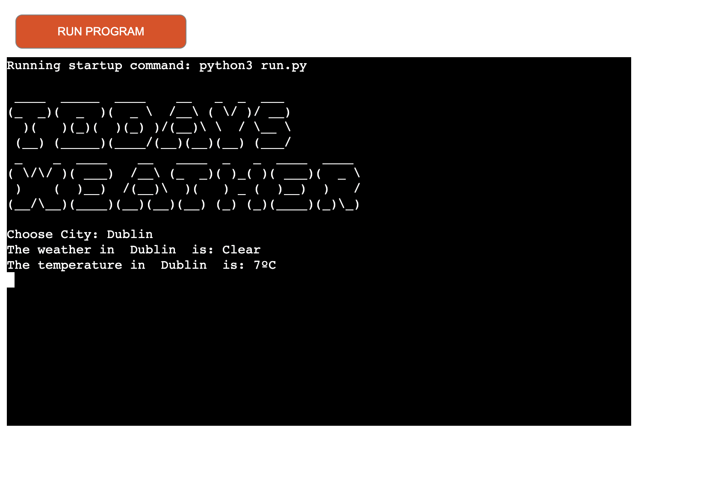
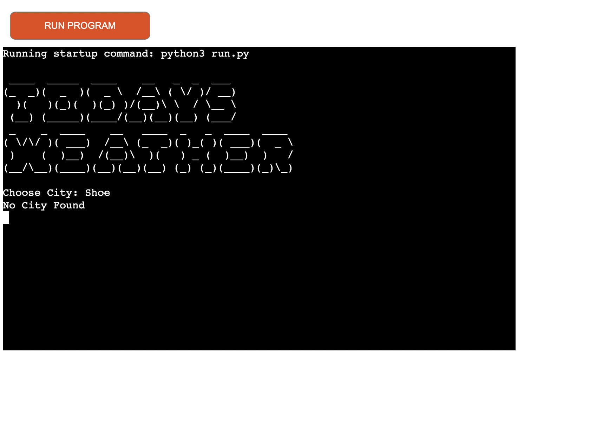

## Application Overview 

* Deployed Site: [Here](https://chloes--weather-app.herokuapp.com/)
Users of the straightforward app 'Todays Weather' may check the temperature and current weather in the city of their choice.  
 

## Goal
I wanted to make an app that is both practical and simple to use. The user may simply observe the current weather and temperature.

## Target Audience
This application is aimed at users of all ages who simply just want to check the weather of any location. 

# Current Features
**Header**
- The 'Todays Weather' header sits at the top of the application and shows the name of the game in a minimalistic font.
- Using the pyfiglet module, the style is produced. The user is prompted to check the weather in any certain city when the software first loads.
 

**Error**
- When a user types in an invalid address, the program displays "no city found." 

# Future Features
- 5 day forecast: The next feature I would want to include is the capability of 5 day forecasting for each city.

- Comparison of Historical Data: OpenWeatherMap provides a premium option for up to 40 years of historical weather information. Future functionality that enables a user to compare weather data to past years is something I would want to implement. This would make it possible to assess the consequences of climate change or a crisis by contrasting real-time data with historical data.

- Add styling to the application and add elements such as, cloud, sun, rain etc. 

# Validation Testing
 When running through the , CI Linter no issues were reported.
 

 ## Bugs

Bug | Status | Fix |
----|--------|-----|
CI Linter Error, line too long on API key| Resolved | Spent time with the student support team and they introduced me to noqa. 
requests==2.28.1 needed to be added to requiremnts.txt | Resolved | Checked with fellow students on Slack. 

# Known issues
- I am aware that not all phones can access the deployed Heroku site. 

- pip install pyfiglet needs to be added to termnial if ' No module named 'pyfiglet' shows'. 

# Deployment 
## Deployment to Heroku
1. Go to [Heroku](https://dashboard.heroku.com/apps)
2. Go to 'New' and select 'Create a new app'
3. Input your app name and create app.
4. Navigate to 'Settings'
5. Install the needed buildpacks. Select Python and install and then node.js and install and then click save. They must be in this order.
6. Navigate to the 'Deploy' section. 
7. Connect to GitHub, search for your repo and confirm. 
8. Choose branch to deploy.
9. Your app should now be available to see. You can choose whether to have your app automatically redeploy with every push or to keep it manual. 

## How to Fork
1. Login/signup to [GitHub](https://github.com/).
2. Locate the relevant repository. 
3. Click on the 'Fork' button in the upper left.
4. Your forked version of this repo will be generated!

### Version Control
*  Git was used as the version control software. Commands such as git add ., git status, git commit and git push were used to add, save, stage and push the code to the GitHub repository where the source code is stored.

# Credits 
 
- Code for the game was inspired by: How to Build a Weather App with Python | Weather API (https://www.youtube.com/watch?v=baWzHKfrvqw&t=453s) Arpan Neupane

- IPython | ASCII art using pyfiglet module was used (https://www.geeksforgeeks.org/python-ascii-art-using-pyfiglet-module/)

- The souce of my API was (https://openweathermap.org/)

- Slack for help off of my fellow classmates.

- The Code Institute for the help of their tutors who helped me shorten a line using noqa. 

- Learning about NO Quality Assurance (noqa) in Python (https://www.geeksforgeeks.org/no-quality-assurance-noqa-in-python/)

